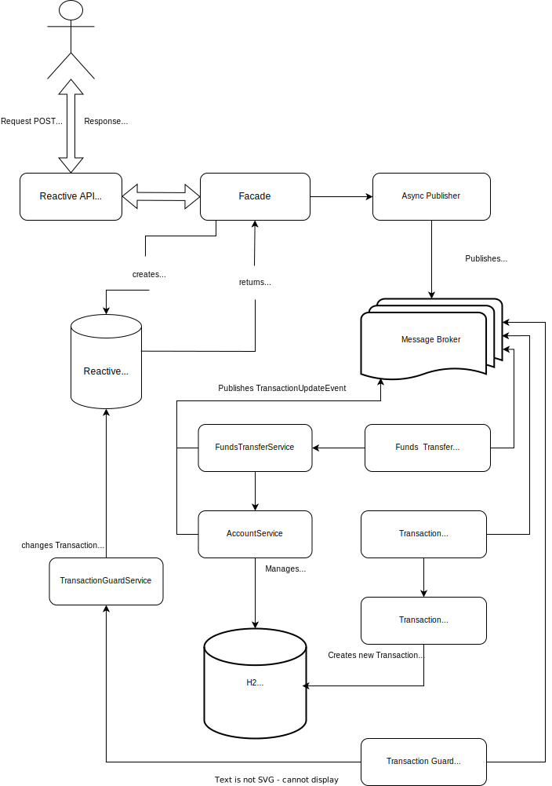

# Assessment Funds Transfer Api
[](https://github.com/morthenn/can-into-space/actions/workflows/maven.yml)

## Problem ##

Define and implement a RESTful API that performs finds transfer between two accounts with currency exchange.

## Requirements ##

- Implementation has to be done in Java
- No security layer (authentication / authorization) needs to be provided
- Implementation has to be able to support being invoked concurrently by multiple users/systems
- The minimal attributes to define an Account are:
  - Owner ID (numeric)
  - Currency (String)
  - Balance (numeric)
- Exchange rates can be retrieved from external APIs
- Program has to be runnable without anu special software/container
- Functionality covered with tests
- Fund transfer should fail if:
  - Either the debit or the credit account does not exist
  - The exchange rate cannot be retrieved
  - The balance of the debit account is not sufficient


## Additional information:

The code is expected to be of good quality and easy to maintain
As business specification is very light, use common sense in case of doubt

## Installation Instructions
You can import the project as a maven application to your favorite IDE and run `mvn clean install` to build project and start breaking test cases ;)

If lombok gets in your way, by referring [this answer](https://stackoverflow.com/a/22332248/4130569), you can install lombok by its jar file.

## To run the application
Use one of the several ways of running a Spring Boot application. Below are just two options:

1. Build using maven goal (or by using maven wrapper): `mvn clean package` and execute the resulting artifact as follows `java -jar AssessmentApiApplication-0.0.1-SNAPSHOT.jar` or
2. On Unix/Linux based systems: run `mvn clean package` then run the resulting jar as any other executable `./AssessmentApiApplication-0.0.1-SNAPSHOT.jar`

## To test the application
1. Use list of predefined accounts:
    ```
   | accountId | ownerId | currency |    balance      isActive
   |   111111  |    1    | 'EUR     |  1000.10   |    true    |
   |   222222  |    1    | 'EUR     |  2000.00   |    true    |
   |   333333  |    2    | 'EUR     |  14000.00  |    true    |
   |   444444  |    3    | 'GBP     |  10.30     |    true    |
   |   555555  |    4    | 'GBP     |  777.80    |    true    |
   |   666666  |    5    | 'GBP'    |  1000.18   |    true    |
   |   777777  |    6    | 'USD'    |  5000.72   |    true    |
   |   888888  |    7    | 'USD'    |  10.44     |    false   |
   |   999999  |    7    | 'USD'    |  7.35      |    true    |
   ```
To order funds transfer use below endpoint and payload:

```
$ curl -X POST localhost:8080/api/v1/account/transfer-funds 
  -d "{
      \"senderAccountId\": \"accountIdFromTableAbove\",
      \"receiverAccountId\": \"accountIdFromTableAbove\",
      \"amount\": numericPositive
      }" 
  -H "Content-Type:application/json"
```

## Flow Diagram


